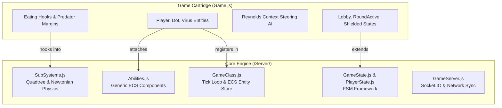

# Specification: Decoupled 2D ECS Engine Architecture

## 1. Architectural Boundary

## 2. Decoupling Guarantees
* **Zero Hardcoded Entity Names in Core**: `/Server/SubSystems.js` and `/Server/GameClass.js` contain zero references to `"dot"`, `"virus"`, or game-specific eating ratios.
* **Generic ECS Flags**:
  - `Collidable.isTrigger`: Bypasses Newtonian physical bounce calculation (used for items, sensors, and pickups).
  - `Collidable.isStatic`: Prevents displacement during positional separation (infinite mass).
* **Static Layer Delte Synchronization**: Background items (e.g. food fields) are marked via `game.markLayerStatic('dots')`. Full snapshots are transmitted once on join; during game ticks, only changed entities (`dotsDelta`) are synced.
